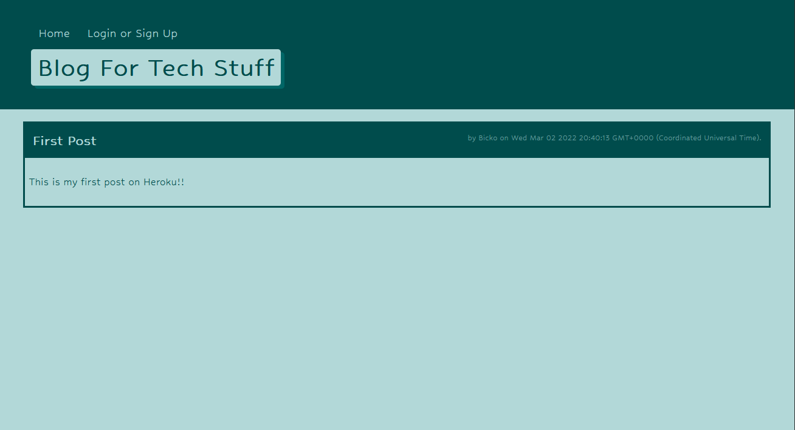

# B.F.T.S - Blog For Tech Stuff

## Description

This is a CMS-style blog site similar to a Wordpress site, where developers can publish their blog posts and comment on other developers’ posts as well. It follows the MVC paradigm in its architectural structure, by using Handlebars.js as the templating language, Sequelize as the ORM, and the express-session npm package for authentication.

This application has been deployed to Heroku for testing purposes. You are more than welcome to visit it.

> Github Repository Link: [https://github.com/Bickolus/ecbe](https://github.com/Bickolus/bfts)
>
> Deployed App (Heroku) Link: 

## Table of Contents

1. [Installation](#installation)
2. [Usage](#usage)
3. [Example](#example)
4. [License](#license)
5. [Questions](#questions)

## Installation

Type "npm install" in the console to install the dependancies this application requires (Express, MySQL2, Dotenv, Sequelize, bcrpyt, session, handlebars). You would also need a MySQL server running to be able to create the database. 

## Usage

In order to run this program, a couple things need to be done. Firstly, the user must create a database by logging into their mySQL server ("mysql -u root -p" in a terminal), then typing "source ./db/schema.sql". Secondly, type "npm start" to run the server. Your localhost:3001/ URL will now have the site deployed.

Alternatively, check out the deployed Heroku link if you wish to utilize the site but do not want your own copy.

## Example

### Gifs of the Program Running

## License

This project is not under any license.

## Questions

My GitHub Page: [Bickolus](https://github.com/Bickolus)

If you have any additional questions, please contact me at smbraza97@gmail.com.
